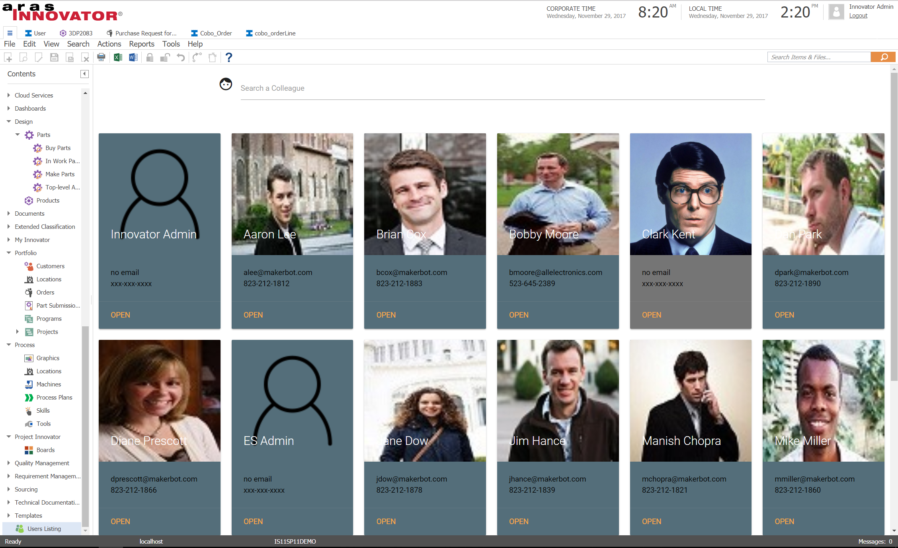
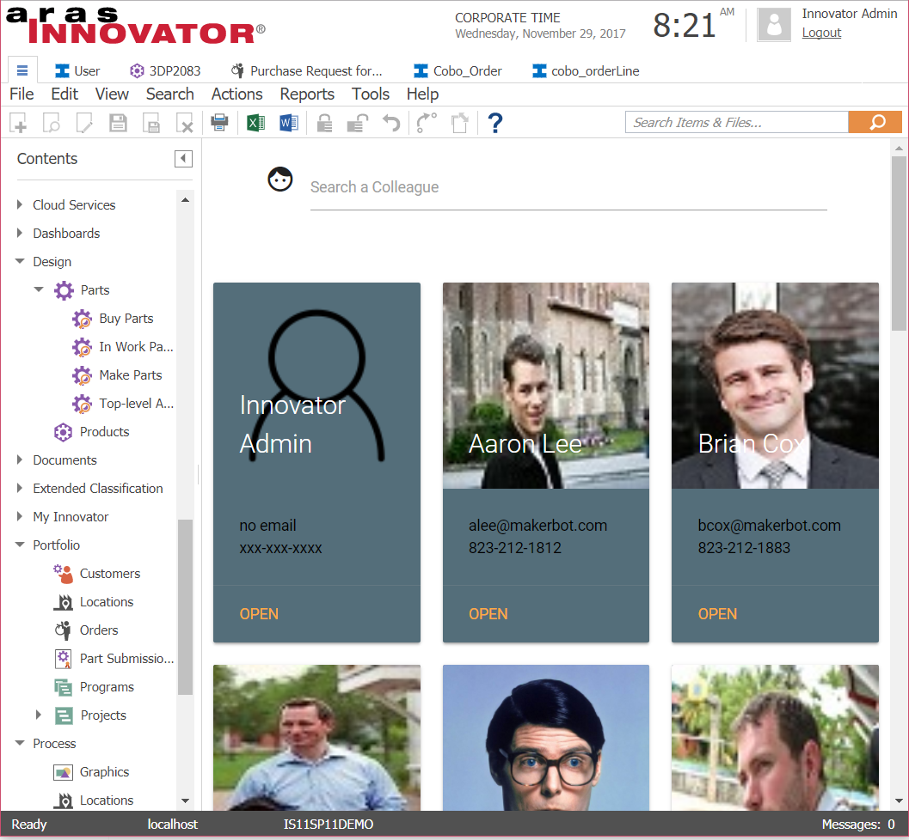
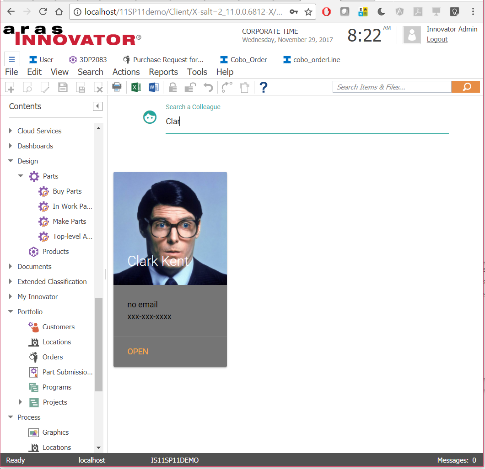

# Visual User Listing
Adds a user interface to quickly browse and filter the list of your colleagues

#### How it works
The Visual User Listing is a simple example of how you can integrate dynamic web pages using alternative Js framework like AngularJs in this case. Even if the best option might be to excel at Dojo.js, we know that more developers are using frameworks like vue.js, angular, angularJs, React,... 

This project lists users but it would be very easy to adapt it for any other itemtype.

## History

Release | Notes
--------|--------
[v1.0.1](https://github.com/ArasLabs/visual-user-listing/releases/tag/v1.0.1) | Tested 11.0 SP12, SP15. Tested on Edge, Internet Explorer, Firefox 60 ESR, Chrome.
[v1.0.0](https://github.com/ArasLabs/visual-user-listing/releases/tag/v1.0.0) | First release. Tested on Internet Explorer 11, Firefox 38 ESR, Chrome. 
> Though built and tested using Aras 11.0 SP9, this project should function in older releases of Aras 11.0 and Aras 10.0.

#### Supported Aras Versions

Project | Aras
--------|------
[v1.0.1](https://github.com/ArasLabs/visual-user-listing/releases/tag/v1.0.1) | 11.0 SP9+, 11.0 SP12+, 11.0 SP15
[v1.0.0](https://github.com/ArasLabs/visual-user-listing/releases/tag/v1.0.0) | 11.0 SP9; Old Community Board Migration

> Though built and tested using Aras 11.0 SP9, this project should function in older releases of Aras 11.0 and Aras 10.0.

## Installation

#### Important!
**Always back up your code tree and database before applying an import package or code tree patch!**

### Pre-requisites

1. Aras Innovator installed (version 11.0 SPx preferred)
2. Aras Package Import tool

### Install Steps

1. Backup your database and store the BAK file in a safe place.
2. Open up the Aras Package Import tool.
3. Enter your login credentials and click **Login**
    * _Note: You must login as root for the package import to succeed!_
4. Enter the package name in the TargetRelease field.
    * Optional: Enter a description in the Description field.
5. Enter the path to your local `..\visual-user-listing\Import\imports.mf` file in the Manifest File field.
6. Select **aras.labs.userListing** in the Available for Import field.
7. Select Type = **Merge** and Mode = **Thorough Mode**.
8. Click **Import** in the top left corner.
9. Close the Aras Package Import tool.
10. Copy `..\visual-user-listing\Innovator` in your install folder
  * _Note: by default c:/Program Files/Aras/Innovator/_

You are now ready to login to Aras and try out kanban-like task management

## Usage

1. Log in to Aras as admin.
2. Navigate to Users Listing at the end of the table of contents (TOC).
3. Users are now listed and you can test some searches

## Contributing

1. Fork it!
2. Create your feature branch: `git checkout -b my-new-feature`
3. Commit your changes: `git commit -am 'Add some feature'`
4. Push to the branch: `git push origin my-new-feature`
5. Submit a pull request

For more information on contributing to this project, another Aras Labs project, or any Aras Community project, shoot us an email at araslabs@aras.com.

## Credits

Original Aras community project written by Yoann Maingon at Aras Corp.

Documented and published by Yoann Maingon at Aras Labs. @YoannArasLab

## Dependencies

- [AngularJs](https://angularjs.org/) 
- [Jquery](https://jquery.com/)
- [materialize](http://materializecss.com/)

## License

Aras Labs projects are published to Github under the MIT license. See the [LICENSE file](./LICENSE.md) for license rights and limitations.
